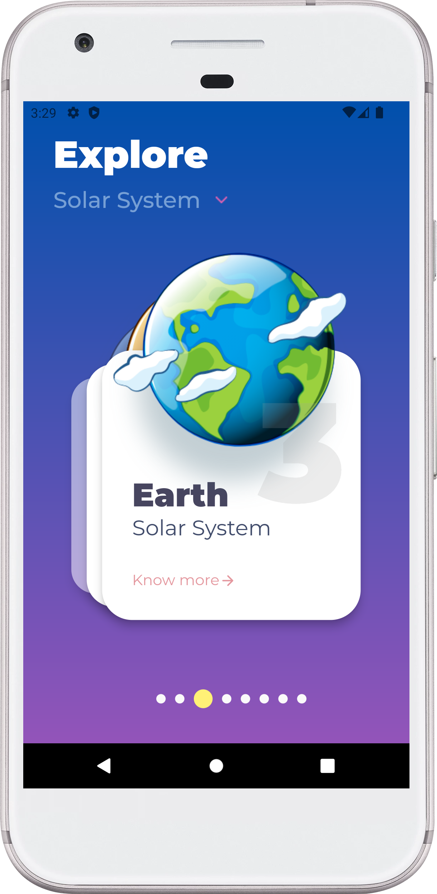
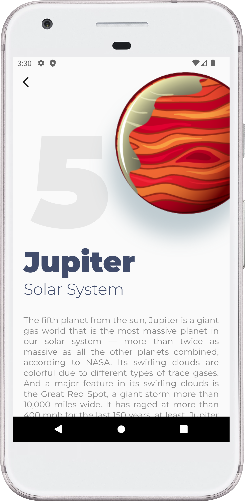

# planet_x

A Flutter project to know more about our universe. 

**Support Me**

- Support me via buy me a coffee. [here](https://www.buymeacoffee.com/alaminkarno)

**Inspired from**

- Code with GitHub by [Anand Krishna](https://github.com/Krishak15)

**Code Credit**

- Code using Flutter with ❤️ by [Md. Al-Amin](https://github.com/alamin-karno)

## Animation and Screenshots (GIF):
|                PlanetX App (GIF)                |                   HomeScreen                    |                  DetailsView Screen                  |
|:-----------------------------------------------:|:-----------------------------------------------:|:----------------------------------------------------:|
|  |  |  |

### Repository Owner Info

### Md. Al-Amin
##### Junior Software Engineer (Android & iOS) at Rokomari.com

__Email :__ [alamin.karno@outlook.com](mailto:alamin.karno@outlook.com) \
__Github :__ [Md. Al-Amin](https://github.com/alamin-karno) \
__Facebook :__ [মোঃ আল-আমিন খন্দকার কর্ণ](https://facebook.com/alamin.kanro) \
__Linkedin :__ [Md. Al-Amin](https://www.linkedin.com/in/alaminkarno/)